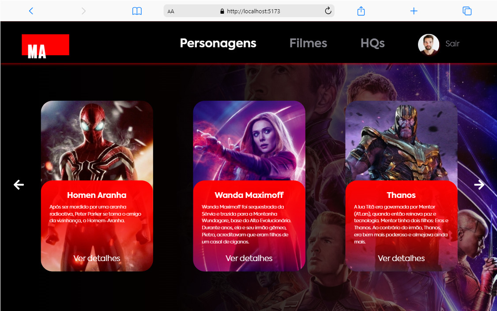

# Desafio Front-end Mestres da web 👩‍💻
## Eduardo Ananias da Silva


> Pagina construida com React-js para renderizar cards com informações de personagens, filmes e quadrinhos. O objetivo foi deixar fiel ao designer e aplicar técnicas do ReactJs, passando por consumo de api, rotas, redux-toolkit, react-useForm e alerts.

## Versão Web responsiva

<div
  style="width:100%; display:flex; gap:16px, flex-wrap: wrap"
>


</div>

## 💻 Como usar o projeto

<h3>Clone o repositorio</h3>

```bash
git clone https://github.com/Du-devBR/desafio-mestres-da-web.git
```

```bash
cd desafio-mestres-da-web/
```

```bash
npm install
```
> Projeto possui uma api simulada pelo json-server na porta 3000, necessario inciar com os comando abaixo.

<h3>Inicie os servidores</h3>

### Api
```bash
npm run json-server
```

### Frontend
```bash
npm run dev
```
<h3>Fluxo da aplicação</h3>
<li>Tela login -></li>
<li>Tela Cadastro -></li>
<li>Tela Login -></li>
<li>Tela Personagens -></li>
<li>Tela Filmes -></li>
<li>Filtros de Filmes -></li>
<li>Tela de quadrinhos -></li>

### Requisitos Técnicos 😁
- [ x ] ReactJS✔  ou nest.JS
- [ x ] TypeScript ✔
- [ x ] Estilização com Styled Components ✔
- [ x ]Responsividade ✔
- [ x ] Organização do projeto ✔
- [ x ] Código limpo ✔
- [ x ]Documentação do projeto ✔

### Requisitos comportamentais
- Aprendizado continuo;
- Interesse por compartilhar experiências;
- Comunicação;
- Visão sistêmica.

### Diferenciais 💖
- [ x ] Local storage.

## 🚀 Melhorias implementadas

- [x] - Pagina de registro de usuario.
- [x] - Animações.

## ToDo
[ x ] - Criar pasta local e criar projeto React com vite

[ x ] - Instalar bibliotecas do projeto e estruturar pastas

[ x ] - Importar arquivos necessarios para o projeto

[ x ] - Criar rotas com react router dom

[ x ] - Criar mock para os dados a serem servidos

[ x ] - Construir telas

[ x ] - Contruir cards

[ x ] - Contruir carousel

[ x ] - Construir modal

[ x ] - Construir header

[ x ] - Construir tela login/cadastro. Persistir dados

[ x ] - Criar redux

[ x ] - Documentar codigo

[ x ] - Responsivo

[ x ] - Criar animações

### 🛠 Tecnologias

As seguintes ferramentas foram usadas na construção do projeto:

- [ViteJs](https://vitejs.dev/)
- [React](https://pt-br.reactjs.org/)
- [Styled-components](https://styled-components.com/docs)
- [Redux](https://redux.js.org/)
- [TypeScript](https://www.typescriptlang.org/)
- [React-hook-form](https://react-hook-form.com/)
- [json-server](https://github.com/typicode/json-server#readme)
